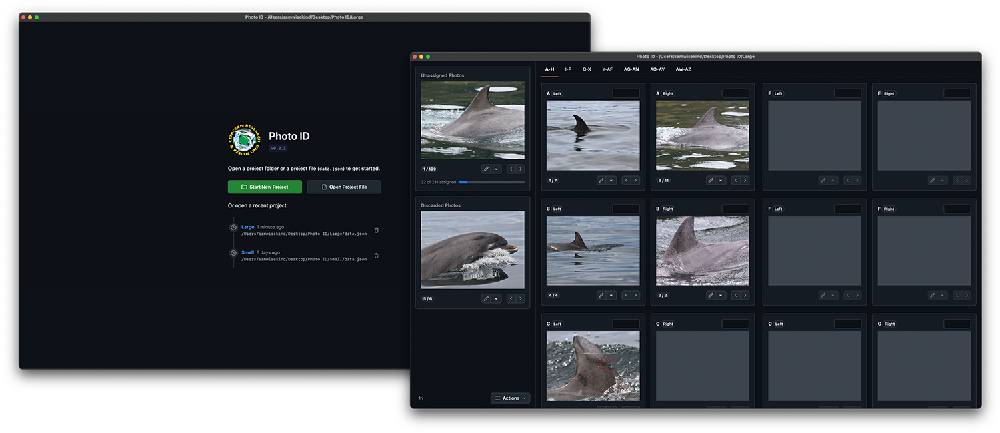

# Photo ID App

- [Introduction](#introduction)
- [Overview](#overview)
- [Installation](#installation)
- [Development](#development)
  - [Debugging](#debugging)

## Introduction

The Photo ID app is a research tool that can be used for photo-identification methodologies for longitudinal mark-recapture studies. It allows for the organisation and matching of photographs containing unique identification markings (such as cetacean dorsal fins). It includes tools for editing and visually filtering photographs to help with identification of marks.

📚 For more information and user guides, [check out the docs](https://photoidapp.crru.org.uk).

## Overview

The app is made up of the following parts:

- [`src/`](src/) contains the main app code
- [`src/assets`](src/assets) contains app assets (e.g. icons)
- [`src/backend`](src/backend) contains backend (_main_) controllers
- [`src/contexts`](src/contexts) contains React contexts
- [`src/frontend`](src/frontend) contains frontend (_renderer_) views and components
- [`src/models`](src/models) contains classes used in the frontend
- [`src/routes`](src/routes) contains frontend routes
- [`src/index.tsx`](src/index.tsx) contains the frontend (_renderer_) entry point
- [`src/main.ts`](src/main.ts) contains the backend (_main_) entry point
- [`src/preload.ts`](src/preload.ts) contains preloaded app methods

## Installation

1. Clone the repository
2. Ensure you are using Node version >= 24 (`nvm install 24` / `nvm use 24`)
3. Install the dependencies by running [`npm ci`](https://docs.npmjs.com/cli/ci.html)
4. If using VS Code install the [ESLint](https://marketplace.visualstudio.com/items?itemName=dbaeumer.vscode-eslint), [Stylelint](https://marketplace.visualstudio.com/items?itemName=stylelint.vscode-stylelint), and [Prettier](https://marketplace.visualstudio.com/items?itemName=esbenp.prettier-vscode) extensions

## Development

Below are the NPM commands that can be used for development:

| Command              | Description                                                      |
| -------------------- | ---------------------------------------------------------------- |
| `start`              | Starts the app in development mode.                              |
| `package`            | Builds and packages the app.                                     |
| `make`               | Builds app distributables.                                       |
| `publish`            | Publishes the app.                                               |
| `changesets:add`     | Adds changeset.                                                  |
| `changesets:version` | Bumps the app version.                                           |
| `changesets:tag`     | Tags the app and pushes to remote.                               |
| `test`               | Runs `test:linting`, `test:types`, and `test:unit` sequentially. |
| `test:linting`       | Runs ESLint and Prettier tests.                                  |
| `test:types`         | Runs TypeScript tests.                                           |
| `test:unit`          | Runs unit tests and generates a coverage report.                 |
| `test:unit:watch`    | Same as `test:unit` but runs it in watch mode.                   |
| `docs`               | Builds and serves documentation locally                          |

### Debugging

Using VSCode, a debugger can be attached to the main process in Electron by running "Debug main process" in the _Run and Debug_ view.
