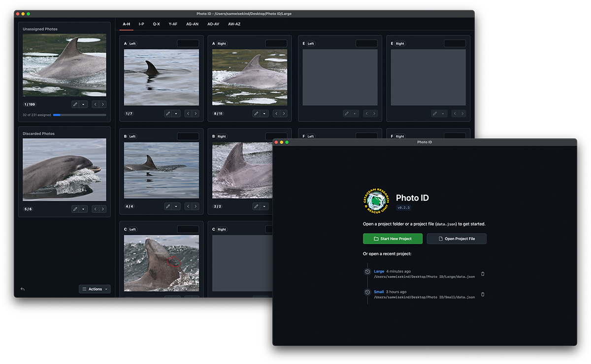

!!! note

    This documentation is a currently work-in-progress.

The Photo ID app is a research tool that can be used for photo-identification methodologies in longitudinal mark-recapture studies. It allows for the organisation and matching of photographs containing unique identification markings (such as the dorsal fins of cetaceans), and includes tools for editing and visually filtering photographs to help with identification of marks.

The app was developed primarily to replace an older, Windows-only program used by CRRU that was no longer compatible with modern systems. This new app has been made [open source](https://github.com/CRRU-UK/photo-id-app), supports multiple platforms (Windows, macOS, Linux), and has a [roadmap of planned features and changes](./roadmap.md)!

The present focus of the app is the _organisation and matching_ of photos by sorting, editing, and grouping photos. As such, it is meant to be used _alongside_ existing catalogues as it has been built to emulate the specific behaviour of our old program – however this may change over time as we refine it! There may also be integrations with catalogue software (including Microsoft Access, which is what we currently use at CRRU) or catalogue management features added to the app in the future (but this is likely very far away).

Some good software for catalogue management:

- [FinBase](https://www.fisheries.noaa.gov/national/marine-mammal-protection/finbase-photo-identification-database-system)
- [finFindR](https://github.com/haimeh/finFindR)
- Microsoft Access
